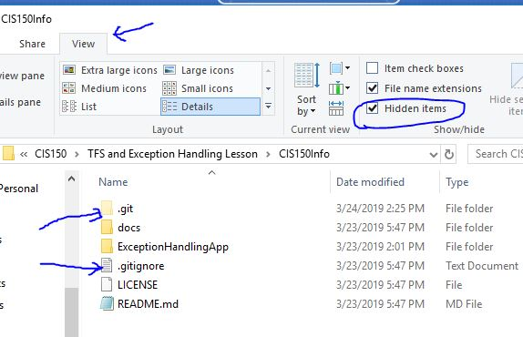
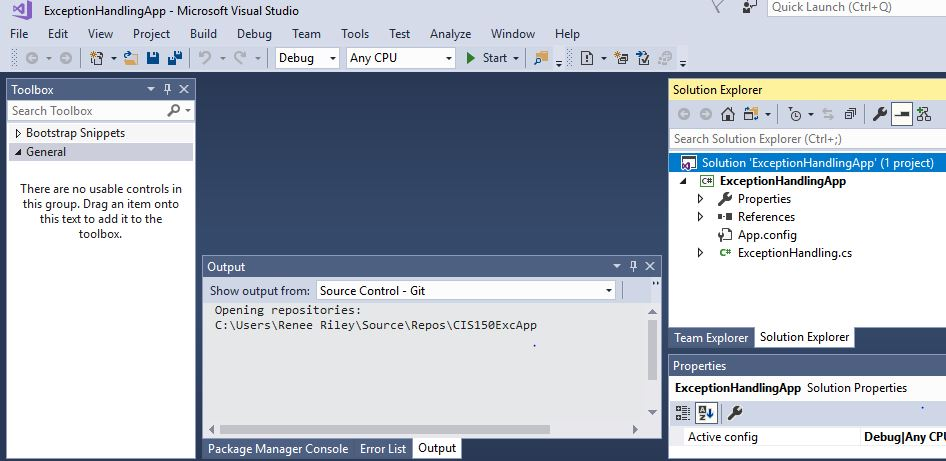

# Welcome to Level 3

## Here are your instructions

#### Locate and save the Exception Handling Assignment
- locate the exception handling project

[ExceptionHandlingProject](https://github.com/OTC-CISRiley/CIS150Info)
- download zip file 
- unzip the contents
### the exception handling project folder is all you need

## remove github connection from the exception handling project folder
Sometimes, a project becomes associated with GitHub and it cannot be added to TFS. If this happens, follow these steps:
1. Locate the project folder in Windows File Explorer
2. Use the View menu bar
3. check the Show Hidden Files option
4. Delete the hidden Git files/folders

## add the project to TFS 
- open visual studio
- connect to tfs
- open the project
- test the project and review the exception handling code try different scenarios to cause exceptions

- add to source control in tfs. if you cannot add to source control, re-do the remove from GitHub procedure
- check in to tfs
- check out the .cs file
- **add internal documentation (comments) to the .cs file**
- check in the updated .cs file
- the project is now ready to turn in and the instructor will view your code from your tfs folder

## complete the Canvas assignment
- submit the assignment on Canvas

